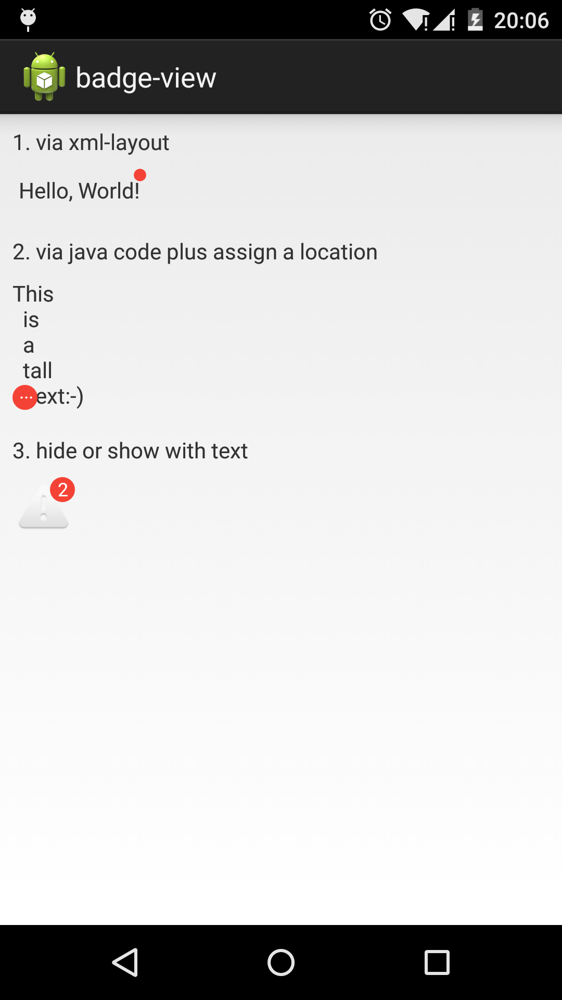

Badge View
===
Badge view is a view group providing to show a badge(or with a text) at four-corner(top-left, top-right, etc.)

Currently, it only support one child(children) just like the framework' s ``android.widget.ScrollView``.

**This is what a learn how to write your customized view group and use it in your practice project. So, if you have any trouble or suggestion, feel free to drop me a line.**



===

### Usage
1. via xml-layout

```xml
<org.heisenberglab.badge.BadgeView
      app:show_badge="true"
      android:layout_width="wrap_content"
      android:layout_height="wrap_content">

    <TextView
        android:padding="4dp"
        android:text="Hello, World!"
        android:layout_width="wrap_content"
        android:layout_height="wrap_content" />
</org.heisenberglab.badge.BadgeView>
```

2. via java code

```java
FrameLayout container = (FrameLayout) findViewById(R.id.container);

// NOTE: the child view must use the same layout-params with the badge!
ViewGroup.LayoutParams lp = new ViewGroup.LayoutParams(
    ViewGroup.LayoutParams.WRAP_CONTENT,
    ViewGroup.LayoutParams.WRAP_CONTENT
);

BadgeView badgeView = new BadgeView(this);
badgeView.setLayoutParams(lp);

TextView tv = new TextView(this);
tv.setLayoutParams(lp);
tv.setText("This\n  is  \n  a  \n  tall  \n   text:-)");

badgeView.addBadgeView(tv);

badgeView.showBadge("...");
badgeView.setBadgeLocation(BadgeView.BadgeLocation.BOTTOM_LEFT);

// add to the container
container.addView(badgeView);
```

### Customized attrs
To see the default value, take a look at the source code, it' s really a simple one.

```xml
<declare-styleable name="BadgeView">
  <attr name="badge_color" format="color" />
  <attr name="badge_text" format="string" />
  <attr name="badge_text_color" format="color" />
  <attr name="badge_text_size" format="dimension" />
  <attr name="normal_badge_radius" format="dimension" />
  <attr name="small_badge_radius" format="dimension" />
  <attr name="badge_margin" format="dimension" />
  <attr name="show_badge" format="boolean" />
  <attr name="show_text_badge" format="boolean" />

  <attr name="badge_location" format="enum">
    <enum name="top_left" value="0" />
    <enum name="top_right" value="1" />
    <enum name="bottom_left" value="2" />
    <enum name="bottom_right" value="3" />
  </attr>
</declare-styleable>
```

### Notice
1. it only supports one child(children), like it said before

2. the lib hasn' t publish to maven central, so you must clone the lib add add it to your gradle-styled ``build.xml`` as a dependency.

3. the badge view simple uses the child(ren)' s width and height as its dimension. So you must specify it either use xml-layout or java code. This inconvenient would be fixed in the next version:-)

4. required android 2.2+ (API level 8). Maybe it could support start at Android 1.0, but it deserves nothing...

### License
```
The MIT License (MIT)

Copyright (c) 2015 longkai

The software shall be used for good, not evil.
```